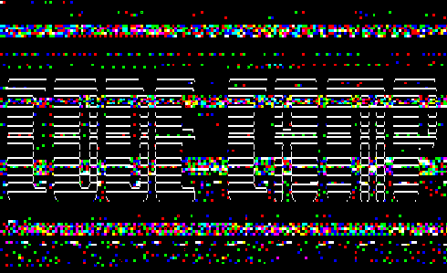

# Code Camp
*An on-line coding primer for the GSA theme in King's College London's Department of Geography*

---

### List of Contents

Welcome! This is the repository for the interactive Jupyter notebooks that will teach you the basics of how to code in Python for
Geographic Data Analysis.

The list of topics include:
- [Notebook-1: Introduction](./notebook-011.ipynb)
- [Notebook-2: Thinking like a computer](./notebook-02.ipynb)
- [Notebook-3: The Basics (Variables, Operators and Precedence)](./notebook-03.ipynb)
- [Notebook-4: Dealing with Errors & Debugging](./notebook-04.ipynb)
- [Notebook-5: Truth & Conditions (Comparisons, Conditions and George Boole)](./notebook-05.ipynb)
- [Notebook-6: Lists](./notebook-06.ipynb)
- [Notebook-7: Dictionaries](./notebook-07.ipynb)
- [Notebook-8: Loops and Iteration](./notebook-08.ipynb)
- [Notebook-9: Functions (Automate All the Things)](./notebook-09.ipynb)
- [Notebook-10: Wrapping Up (A Brief Note on Style)](./notebook-10.ipynb)

### Setting Up

There are several ways to run these notebooks explained [on our blog](https://kingsgeocomputation.org/teaching/code-camp/code-camp-python/setup/), but the most straightforward way to get started is [using Binder](https://mybinder.org/v2/gh/kingsgeocomp/code-camp/master).

### Learning Outcomes

By the end of the course, you will have a solid understanding of:

- The rational behind the usage of computers and computational methodologies in Geography
- The way computers "think" and "work"
- How computers programs are structured and how to execute them
- The fundamental concepts of programming (in Python, but extensible in general terms to any other programming language) such as the concept of `variable`, `iteration`, `data structure`, `list`, `object`, `loop`, `function` etc etc..
- How your newly acquired coding skills can extend traditional GIS methodologies and be applied to solve to geographical problems

### References:
The material contained in this repository is heavily inspired by the [great work](http://darribas.org/gds15/index.html) of [Dani Aribas-Bel](https://twitter.com/darribas):
`Arribas-Bel, D. (2016). Geographic Data Science’15. http://doi.org/{10.5281/zenodo.46313}`
